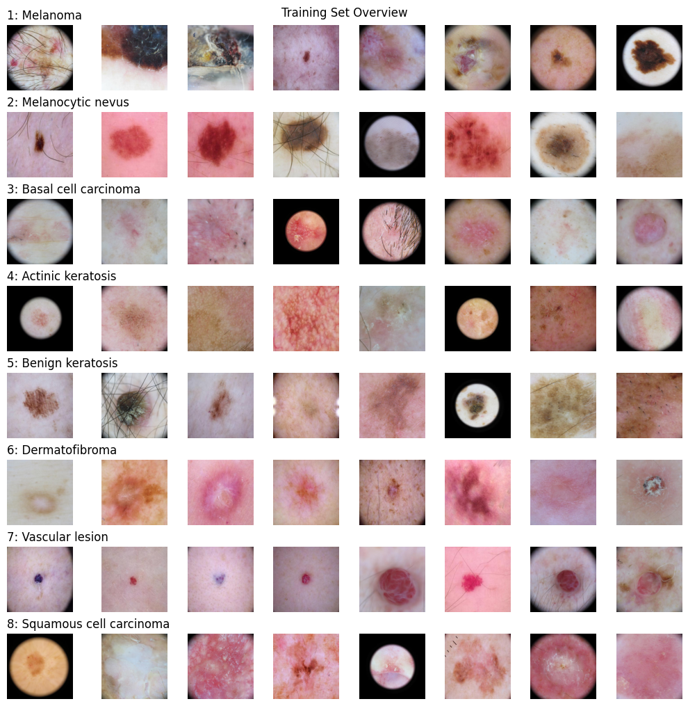
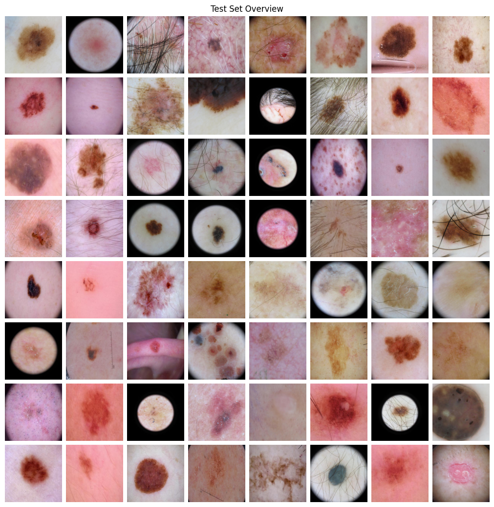
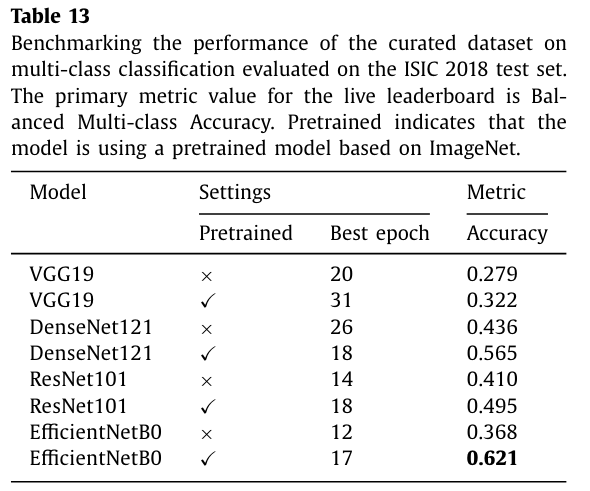
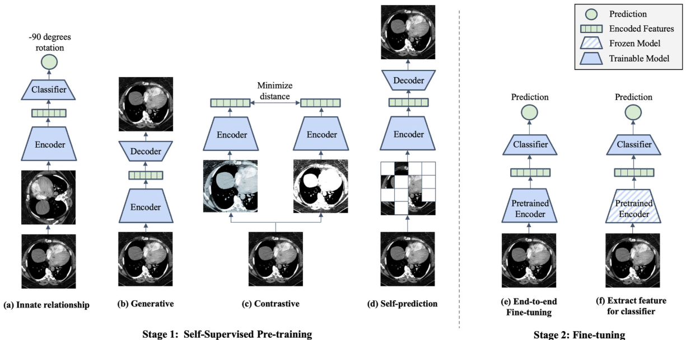
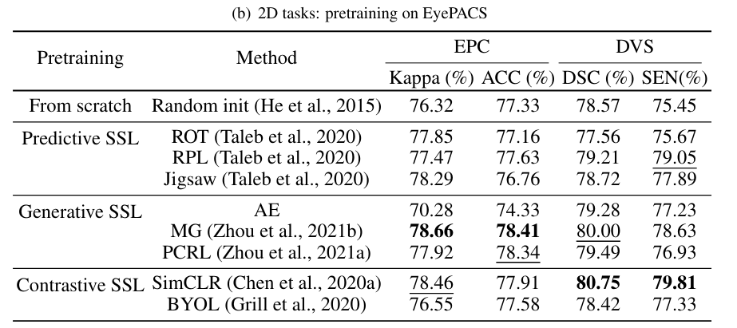

# IMA205_Challenge_2024

skin cancer detection

[](https://www.kaggle.com/competitions/ima205-challenge-2024/overview)  


## Telecom Paris Cluster User Guide

...


## Introduction

### Goal of the challenge

The goal of this challenge is to classify dermoscopic images of skin lesions among eight different diagnostic classes:

1. Melanoma
2. Melanocytic nevus
3. Basal cell carcinoma
4. Actinic keratosis
5. Benign keratosis
6. Dermatofibroma
7. Vascular lesion
8. Squamous cell carcinoma

In order to do that, you will extract features such as the Asymmetry, the Border irregularity, the Colour and the Dimension of the lesion (usually called the ABCD rule). After that, you will use machine learning algorithms to classify the images.

>这个挑战的目标是对八种不同诊断类别的皮肤病变的皮肤镜图像进行分类：
>1. 黑色素瘤
>2. 黑色素痣
>3. 基底细胞癌
>4. 光老化性角化病
>5. 良性角化病
>6. 皮肤纤维瘤
>7. 血管病变
>8. 鳞状细胞癌
>  为了做到这一点，你将提取诸如不对称性、边界不规则性、颜色和病变的尺寸（通常称为 ABCD 规则）等特征。然后，你将使用机器学习算法对这些图像进行分类。

---

### Dataset -- ISIC 2019

You will use a data-set of 25331 dermoscopic images of skin lesions with, when available, their relative segmentation and metadata (age, sex and anatomical position). Data has already been randomly split into a training-validation set (75%) and a test set (25%). You only have the classification (made by clinicians) of the training-validation set. The goal of the project is to estimate the correct class of each dermoscopic image in the test set. **You can only use the data provided in this challenge**

```python
df = pd.read_csv("../data/metadataTrain.csv")
df.head()
```

|      |           ID | CLASS |    SEX |  AGE |        POSITION |
| ---: | -----------: | ----: | -----: | ---: | --------------: |
|    0 | ISIC_0028766 |     2 |   male | 30.0 |             NaN |
|    1 | ISIC_0071222 |     8 |   male | 85.0 | lower extremity |
|    2 | ISIC_0069434 |     3 |   male | 85.0 |       head/neck |
|    3 | ISIC_0062098 |     1 |   male | 55.0 |       head/neck |
|    4 | ISIC_0057224 |     8 | female | 45.0 | lower extremity |

```python
df.shape
(18998, 5)
```


```python
df.groupby("CLASS").size()
###
1 Melanoma 3391
2 Melanocytic nevus 9657
3 Basal cell carcinoma 2492
4 Actinic keratosis 650
5 Benign keratosis 1968
6 Dermatofibroma 179
7 Vascular lesion 190
8 Squamous cell carcinoma 471
```





## Papers & Related Work

- ISIC Challenge Datasets[^1] [^2]  

  International *Skin Imaging* Collaboration

  | Dataset   | Train  | Test   | Total  |
  | :-------- | :----- | :----- | :----- |
  | ISIC 2016 | 900    | 379    | 1279   |
  | ISIC 2017 | 2000   | 600    | 2600   |
  | ISIC 2018 | 10,015 | 1512   | 11,527 |
  | ISIC 2019 | 25,331 | 8238   | 33,569 |
  | ISIC 2020 | 33,126 | 10,982 | 44,108 |

  - EfficientNet
  - Hekler et al. (2020) investigated the effects of label noise on CNNs for skin cancer classification
  - The testing set consists of 9 classes, 8 classes as in the training set **plus an additional unknown class.**
  - The ISIC 2019 dataset is also notable for including multiplets of single lesions which feature the same lesion at different zoom levels which may provide important unique features at different levels of magnification.
  - Duplicate removal strategy
  - 
  - 

- Medical Image Classification[^2]

- Self-Supervised Multi-Modality Learning for Multi-Label Skin Lesion Classification[^3]
  - SimCLR
  - Self-Supervised Learning
  
- Towards Automated Melanoma Detection with Deep Learning: Data Purification and Augmentation[^4]
  - DCGAN: 
  
- https://github.com/huggingface/pytorch-image-models

- Label-relation-aware solution

- A novel end-to-end deep convolutional neural network based skin lesion classification framework[^6]
  - S-MobileNet using Mish with pruning of layers
  - S-MobileNet using Relu
  
- Advancing Dermatological Diagnostics: Interpretable AI for Enhanced Skin Lesion Classification[^7]
  - This challenge focuses on developing a classifier capable of distinguishing among nine distinct diagnostic categories of skin cancer: MEL (melanoma), NV (melanocytic nevus), BCC (basal cell carcinoma), AK (actinic keratosis), BKL (benign keratosis), DF (dermatofibroma), VASC (vascular lesion), SCC (squamous cell carcinoma), and UNK (unknown, none of the others/out-of-distribution)
  
- A survey on deep learning for skin lesion segmentation[^8]
  - ISIC 2019 contains 25, 331 training images and 8, 238 test images (diagnostic distribution unknown). The images range from 600 × 450 to 1, 024 × 1, 024 pixels.

- Self-supervised learning for medical image classification: a systematic review and implementation guideline[^9]

  
  
- Dive into the details of self-supervised learning for medical image analysis[^10]

  - Some issues:
    1. the impact of SSL on imbalanced datasets, 
    2. the network architecture, 
    3. the applicability of upstream tasks to downstream tasks and 
    4. the stacking effect of SSL and common policies for deep learning.
  
  - Some statistics
  
    
  
  - However, we argue that the Ushape architecture with skip connections that are particularly designed for segmentation might be sub-optimal for generative pretext tasks.
  
  - 

- PySSL : Self-Supervised Learning being easy again![^11]
- center-cropping


- [Self-supervised learning with self-distillation on COVID-19 medical image classification ](https://www.sciencedirect.com/science/article/abs/pii/S0169260723005424)
- [Self-Supervised Pre-Training with Contrastive and Masked Autoencoder Methods for Dealing with Small Datasets in Deep Learning for Medical Imaging](https://arxiv.org/pdf/2308.06534.pdf)
- 


---

## Reference

[^1]: https://challenge.isic-archive.com/data/
[^2]: https://paperswithcode.com/task/medical-image-classification
[^3]: https://arxiv.org/pdf/2310.18583v2.pdf
[^4]: https://openaccess.thecvf.com/content_CVPRW_2019/papers/ISIC/Bisla_Towards_Automated_Melanoma_Detection_With_Deep_Learning_Data_Purification_and_CVPRW_2019_paper.pdf
[^5]: [Analysis of the ISIC image datasets: Usage, benchmarks and recommendations](https://www.sciencedirect.com/science/article/pii/S1361841521003509)
[^6]: https://www.sciencedirect.com/science/article/pii/S0957417423035583
[^7]: https://www.mdpi.com/2075-4418/14/7/753
[^8]: https://arxiv.org/pdf/2206.00356.pdf
[^9]: [Self-supervised learning for medical image classification: a systematic review and implementation guidelines](https://www.nature.com/articles/s41746-023-00811-0)

[^10]: https://arxiv.org/pdf/2209.12157.pdf
[^11]: [PySSL : Self-Supervised Learning being easy again!](https://medium.com/@giakoumoglou4/pyssl-self-supervised-learning-being-easy-again-6debd9e442b8)


